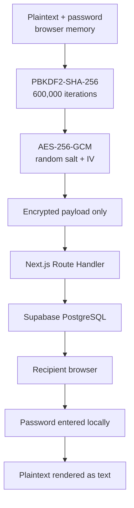

# TextSafe

TextSafe is a bilingual Next.js application for sharing expiring encrypted notes. Encryption and decryption happen in the browser; the server receives ciphertext, never the original message or password.

## Features

- English-default locale routing at `/en` with Indonesian at `/id`
- AES-256-GCM authenticated encryption through the Web Crypto API
- PBKDF2-SHA-256 key derivation with a random 16-byte salt and 600,000 iterations
- Unique random 12-byte IV for every encryption
- Expiration choices from 10 minutes to 7 days
- Atomic burn-after-reading retrieval
- No accounts and no plaintext storage
- Light/dark themes, keyboard access, reduced-motion support
- Strict server validation, payload limits, security headers, no-store responses, and rate-limiter interface
- Vercel and Supabase deployment support

## Security architecture



The browser sends only `version`, algorithm and KDF identifiers, iteration count, salt, IV, ciphertext, expiration choice, and burn setting. Passwords and plaintext must never enter a Server Action, query string, cookie, browser storage, analytics event, or application log.

For burn-after-reading messages, the PostgreSQL RPC locks the row, creates a short-lived consumed-ID tombstone, and deletes the ciphertext in one transaction. Of concurrent retrievals, only one can return the payload. Retrieval consumes the message even when the recipient later supplies a wrong password because the server cannot validate a password it never receives.

## Requirements

- Node.js 20.9 or later
- npm
- A Supabase project
- A Vercel or Netlify project for production deployment

## Local installation

```bash
git clone https://github.com/tirsasaki/textsafe.git
cd textsafe
npm install
cp .env.example .env.local
npm run dev
```

Open [http://localhost:3000](http://localhost:3000). The root redirects to `/en`.

## Supabase setup

1. Create a new Supabase project dedicated to TextSafe.
2. Open the SQL editor and run `supabase/migrations/202609140001_create_encrypted_messages.sql`.
3. From Project Settings → API, copy the project URL and service-role key.
4. Put them only in server environment variables:

```dotenv
NEXT_PUBLIC_SUPABASE_URL=https://YOUR_PROJECT.supabase.co
SUPABASE_SERVICE_ROLE_KEY=YOUR_SERVICE_ROLE_KEY
CRON_SECRET=GENERATE_A_LONG_RANDOM_SECRET
NEXT_PUBLIC_SITE_URL=https://YOUR_DOMAIN.example
```

Despite the `NEXT_PUBLIC_` prefix, the Supabase URL is not a credential. The service-role key must never use that prefix and must never be exposed to the browser. RLS is enabled with no policies for `anon` or `authenticated`; only server Route Handlers use the service role.

For CLI migrations, link a non-production project first and run:

```bash
npx supabase link --project-ref YOUR_TEST_PROJECT_REF
npx supabase db push
```

Do not point development or integration tests at production.

## Quality checks

```bash
npm run lint
npm run typecheck
npm test
npm run build
```

Database integration tests use a separate migrated Supabase project:

```dotenv
TEST_SUPABASE_URL=
TEST_SUPABASE_SERVICE_ROLE_KEY=
```

Then run `npm run test:integration`. Without both variables, destructive database integration tests are skipped.

## Expired-message cleanup

Retrieval always rejects and removes an expired message, even if cron is unavailable.

### Vercel Cron

`vercel.json` calls `/api/cron/cleanup` hourly. Add `CRON_SECRET` in Vercel. Vercel sends `Authorization: Bearer <CRON_SECRET>`; the endpoint rejects missing or incorrect credentials.

### Supabase Cron

Alternatively, enable `pg_cron` and schedule the protected function from SQL under a suitably privileged owner:

```sql
select cron.schedule(
  'textsafe-cleanup',
  '17 * * * *',
  $$select public.cleanup_expired_messages();$$
);
```

Use one cleanup mechanism, not both.

## Deploy to Vercel

1. Import `tirsasaki/textsafe` in Vercel.
2. Set all four variables from `.env.example`; use the production origin for `NEXT_PUBLIC_SITE_URL`.
3. Keep `SUPABASE_SERVICE_ROLE_KEY` and `CRON_SECRET` marked secret and scoped to the required environments.
4. Deploy only after the migration has completed.
5. Confirm `/en`, `/id`, create/retrieve, expiry, and one-time retrieval against disposable test messages.

## Deploy to Netlify

1. Import `tirsasaki/textsafe` in Netlify.
2. Set the build command to `npm run build` and publish directory to `.next`; these values are also defined in `netlify.toml`.
3. Add `NEXT_PUBLIC_SUPABASE_URL`, `SUPABASE_SERVICE_ROLE_KEY`, `CRON_SECRET`, and `NEXT_PUBLIC_SITE_URL` in Project configuration → Environment variables.
4. Set `NEXT_PUBLIC_SITE_URL` to the final HTTPS Netlify or custom-domain origin.
5. Keep `CRON_SECRET` and `SUPABASE_SERVICE_ROLE_KEY` secret. They must never be added to `SECRETS_SCAN_OMIT_KEYS`.
6. `NEXT_PUBLIC_SITE_URL` is intentionally public and embedded in canonical URLs, metadata, and sitemap output. The committed `netlify.toml` excludes only this key from Netlify's environment-value scan while keeping secret scanning enabled.
7. Apply the Supabase migration before testing message creation.

The Vercel schedule in `vercel.json` is not used by Netlify. On Netlify deployments, configure a Netlify Scheduled Function or use Supabase Cron/pg_cron for periodic cleanup. Secret retrieval still rejects and deletes expired records even when scheduled cleanup is not configured.

## Production checklist

- [ ] Migration applied to the intended Supabase project
- [ ] Service-role key exists only in Vercel server settings
- [ ] A long random `CRON_SECRET` is configured
- [ ] `NEXT_PUBLIC_SITE_URL` uses the final HTTPS origin
- [ ] Preview deployments use separate Supabase data
- [ ] CSP, Referrer-Policy, no-store, and noindex headers verified
- [ ] Browser Network panel shows no plaintext or password
- [ ] Two simultaneous burn retrievals return the ciphertext only once
- [ ] Rate limiting replaced with a shared Upstash Redis implementation for multi-instance production
- [ ] Hosting access-log retention reviewed
- [ ] Dependency and security updates enabled

## Security limitations

A lost password cannot be recovered. TextSafe cannot protect against weak passwords, phishing, screenshots, clipboard history, malware, keyloggers, malicious extensions, a compromised device, or sending the link and password together. Hosting infrastructure may process IP addresses, user agents, and request metadata, so this project does not claim zero logs or complete anonymity.

See [SECURITY.md](SECURITY.md) for vulnerability reporting and the in-app Security page for the threat model.

## License

TextSafe uses the BSD 3-Clause License. Redistribution must retain the copyright notice, license conditions, and disclaimer. The license permits commercial use; it does not prohibit all commercial activity. See [LICENSE](LICENSE).
